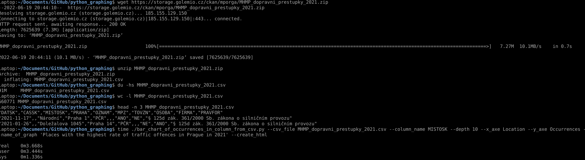

# python_graphing

Extract column from csv, uniq the values, count number of repeated values, sort by occurrences and put it on to the graph.

It is fast thanks to Pandas and Numpy, see the example processed on Dell Latitude 5401 bellow, data used from example are open data provided by city of Prague.

[Example html presentation from example above]('Places with the highest rate of traffic offences in Prague in 2021.html')
