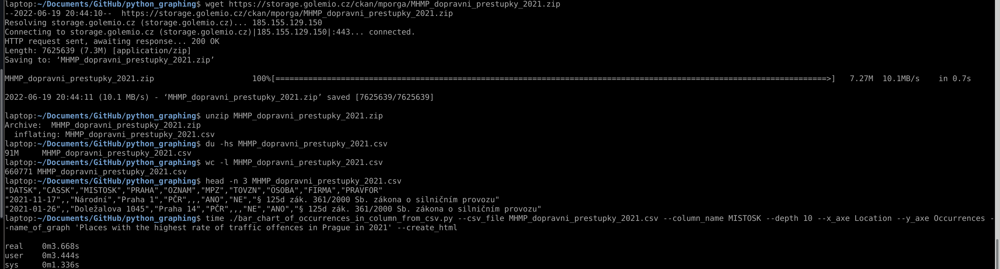

# python_graphing

Extract column from csv, uniq the values, count number of repeated values, sort by occurrences and put it on to the graph.

It is fast thanks to Pandas and Numpy, see the example bellow, data used from example are open data provided by city of Prague.

### Example

Create bar chart of tenth places with highest rate of traffinc offences in Prague in 2021. 

- Data file has size of 97MB and contains 660771 lines.
- Graph has been generated on Dell Latitude5401

here is the process captured.

here is the Result in .png

Whole interactive HTML representation is [here]('Places%20with%20the%20highest%20rate%20of%20traffic%20offences%20in%20Prague%20in%202021.html')
